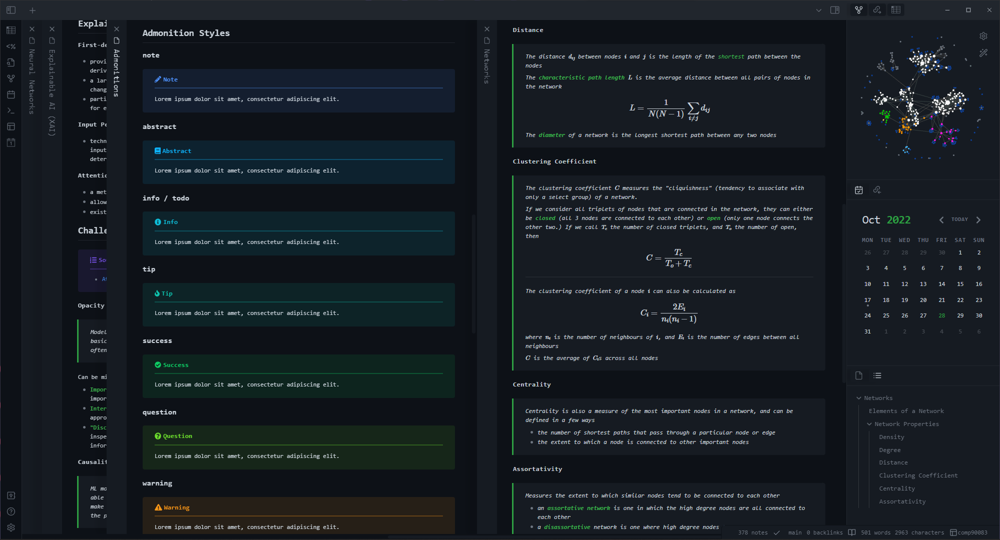

# Deeper Work

Deeper work is a **dark** theme for [Obsidian](https://obsidian.md) heavily inspired the [Deep Work](https://github.com/nikbrunner/obsidian-deep-work-theme) theme, which is no longer maintained.

## Sample Image

> 

## Features

- Calendar support
- Stacked panes support (with shadows)
- Callout formatting with large titles and ruled lines (more similar to Obsidian 0.x.x)
- The original [Deep Work](https://github.com/nikbrunner/obsidian-deep-work-theme) colour scheme
