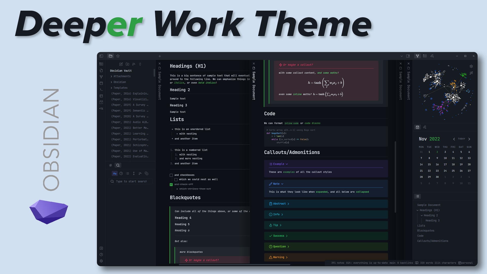
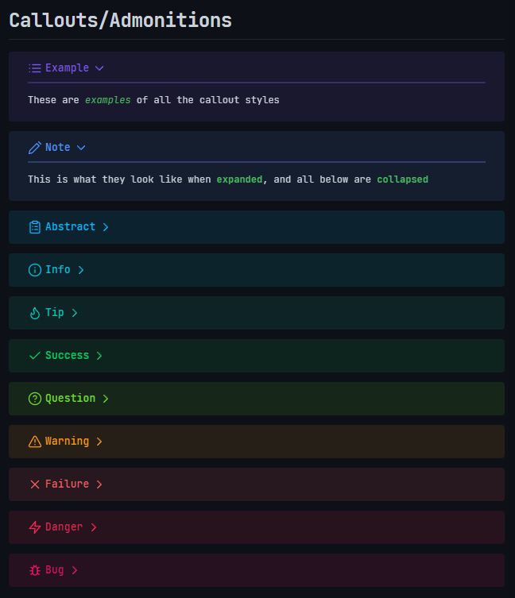

 <h3> Deeper work is a dark theme for <a href="https://obsidian.md"> Obsidian </a> heavily inspired the <a href="https://github.com/nikbrunner/obsidian-deep-work-theme"> Deep Work </a> theme, which is no longer maintained. </h3> 

## Features

- stacked panes support (with shadows)
- calendar support
- callout formatting with large titles and ruled lines (more similar to Obsidian 0.x.x)
- the original [Deep Work](https://github.com/nikbrunner/obsidian-deep-work-theme) colour scheme
- designed to use [JetBrains Mono](https://www.jetbrains.com/lp/mono/) if installed
  - works with ligatures

## Image Samples

_All samples use [JetBrains Mono](https://www.jetbrains.com/lp/mono/) for all font options in the Obsidian settings._

> ##### Full App Screenshot
>
> 

> ##### Sample Note
>
> 

> ##### Callouts
>
> 
